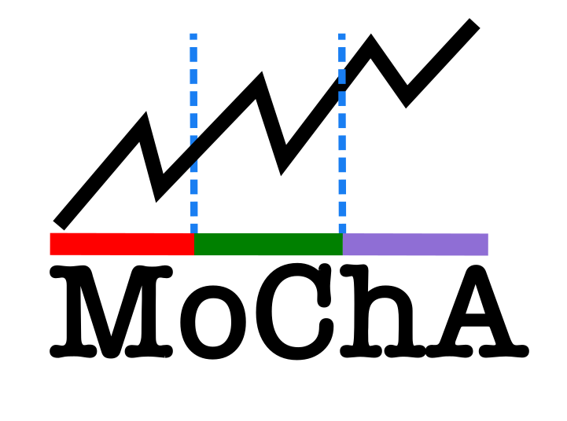

# TSCPDetector.jl

<p align="center">

</p>

<p align="center">

[](https://Mehdilotfi7.github.io/TSCPDetector.jl/stable/)
[](https://codecov.io/gh/Mehdilotfi7/TSCPDetector.jl)
</p>

---

## 🔍 Overview

**TSCPDetector.jl** is a Julia package for simulating time-dependent models (ODEs, difference equations) and detecting **change points** in their dynamics using evolutionary optimization.

Supports:
- Differential and difference equation models
- Segment-wise simulation and optimization
- Automatic model management and loss evaluation
- BIC/AIC-style regularization

👉 **[📘 Full Documentation](https://Mehdilotfi7.github.io/TSCPDetector.jl/stable/)**

---

## ⚡ Installation

```julia
using Pkg
Pkg.add("TSCPDetector")
```
## Package_development
This package was originally developed by Mehdi Lotfi (@mehdilotfi7) in 2024. It is currently being maintained and extended by Mehdi Lotfi.
