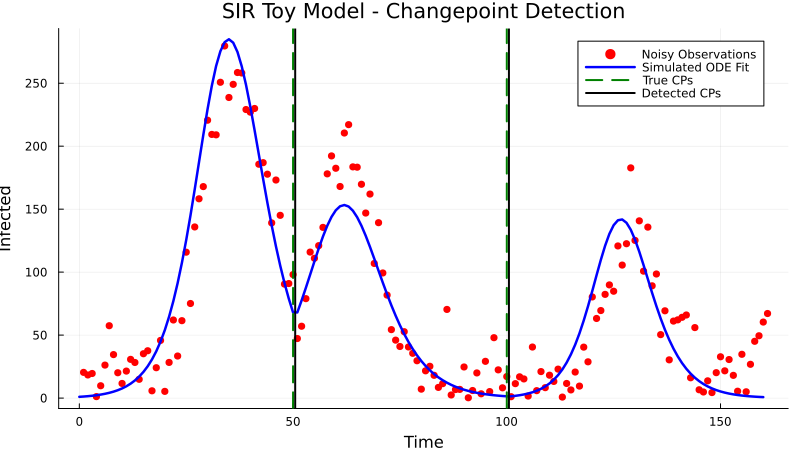

# Examples

This page provides illustrative examples demonstrating how to use Mocha.jl for changepoint detection across a range of domains. Before you go through this page, we recommend you to first familirize yoursef with the algorithm in [Tutorial: Understanding Mocha's Changepoint Detection Algorithm](@ref) page.

---

## Working with functions

```@example
using Statistics # hide
x=1
```

## Example 1: Toy SIR Model with Synthetic Data

This example demonstrates detecting changepoints in a simple SIR (Susceptible-Infectious-Recovered) epidemic model with synthetic data. The infection rate (β) changes at specific points in time.

```julia
using Evolutionary, DifferentialEquations, LabelledArrays, Plots, Statistics, Random

# Define the SIR model dynamics
function sirmodel!(du, u, p, t)
    S, I, R = u
    β, γ = p
    du[1] = -β * S * I
    du[2] = β * S * I - γ * I
    du[3] = γ * I
end

# Generate synthetic data with changepoints
function generate_toy_dataset(beta_values, change_points, γ, u0, tspan, noise_level, noise)
    data_CP = []
    all_times = []
    for i in 1:length(change_points)+1
        tspan_segment = i == 1 ? (0.0, change_points[i]) :
                        i == length(change_points)+1 ? (change_points[i-1]+1.0, tspan[2]) :
                        (change_points[i-1]+1.0, change_points[i])
        params = @LArray [beta_values[i], γ] (:β, :γ)
        prob = ODEProblem(sirmodel!, u0, tspan_segment, params)
        sol = solve(prob, saveat = 1.0)
        data_CP = vcat(data_CP, sol[2,:] + noise_level * noise(length(sol.t)))
        all_times = vcat(all_times, sol.t)
        u0 = sol.u[end]
    end
    return all_times, abs.(data_CP)
end

# Setup parameters
β_values = [0.00009, 0.00014, 0.00025, 0.0005]
change_points_true = [50, 100, 150]
γ = 0.7
u0 = [9999.0, 1.0, 0.0]
tspan = (0.0, 160.0)
Random.seed!(1234)
noise_level = 20
noise = randn

# Generate data and reshape
_, data = generate_toy_dataset(β_values, change_points_true, γ, u0, tspan, noise_level, noise)
data_M = reshape(Float64.(data), 1, :)
plot(data_M[1, :])

# Redefine model with named parameters
function sirmodel!(du, u, p, t)
    S, I, R = u
    β, γ = p.β , p.γ
    du[1] = -β * S * I
    du[2] = β * S * I - γ * I
    du[3] = γ * I
end

# Wrapper for Mocha
function example_ode_model(params, tspan::Tuple{Float64, Float64}, u0::Vector{Float64})
    prob = ODEProblem(sirmodel!, u0, tspan, params)
    sol = solve(prob, Tsit5(), saveat=1.0, abstol = 1.0e-6, reltol = 1.0e-6)
    return sol[:, :]
end

# Loss function for fitting
function loss_function(observed, simulated)
    simulated = simulated[2:2, :]
    return sqrt(sum(abs2, (observed .- simulated).^2))
end

# Prepare model and settings
initial_chromosome = [0.69, 0.0002]
parnames = (:γ, :β)
bounds = ([0.1, 0.0], [0.9, 0.1])
u0 = [9999.0, 1.0, 0.0]
model_spec = ODEModelSpec(example_ode_model, initial_chromosome, u0, tspan)
model_manager = ModelManager(model_spec)
n_global, n_segment_specific = 1, 1
min_length, step = 10, 10
ga = GA(populationSize=150, selection=uniformranking(20),
        crossover=MILX(0.01, 0.17, 0.5), mutationRate=0.3,
        crossoverRate=0.6, mutation=gaussian(0.0001))
my_penalty(p, n) = 10.0 * p * log(n)
n = length(data_M)

# Detect changepoints
detected_cp, params = detect_changepoints(
    objective_function,
    n, n_global, n_segment_specific,
    model_manager,
    loss_function,
    data_M,
    initial_chromosome, parnames, bounds, ga,
    min_length, step, my_penalty
)

```




---

## Example 2: COVID-19 Intervention Detection in Germany

This example demonstrates Mocha's application for analyzing the effects of governmental interventions during the COVID-19 pandemic in Germany.

The model includes:

* 11 state variables including: susceptible, multiple stages of infection, deaths, recovered, and vaccination.

* 8 segment-specific parameters re-estimated for each detected segment.

* 8 global parameters re-optimized after each new changepoint is detected.

The objective function uses five observational signals:

* Infected

* Hospitalized

* ICU admissions

* Deaths

* Vaccination

A logarithmic transformation is applied to each signal before loss computation to normalize the magnitude of variation. The optimization and detection pipeline uses a tailored genetic algorithm and domain-informed parameter bounds.

After executing the Mocha changepoint detection routine, most of the inferred changepoints corresponded to known intervention periods, such as lockdowns or vaccination policy shifts. This result affirms Mocha’s practical utility for epidemiological modeling and policy evaluation.

**📌 Note:** Due to the use of real datasets, this example requires importing and pre-processing COVID-19 time series data from official RKI sources (CSV files).

We begin by defining an ODE-based epidemiological model for simulating the spread of COVID-19. To account for seasonal variation in transmission rates, a seasonality function is incorporated directly into the infection dynamics. The model is then wrapped with a solver function using the **DifferentialEquations.jl** package, which allows for accurate and efficient numerical integration.

```julia
using Evolutionary 
using DifferentialEquations
using LabelledArrays
using Plots
using Statistics
using Random
using CSV
using DataFrames

# seasonal factor
function fδ(t::Number, δ::Number, t₀::Number=0.0)
    return 1 + δ*cos(2*π*((t - t₀)/365))
end

function log_transform(data, threshold=1e-3)
    return [val > threshold ? log(val) : val for val in data]
end

# ODE model
function CovModel!(du,u,p,t)
    (ᴺS, ᴺE₀, ᴺE₁, ᴺI₀, ᴺI₁, ᴺI₂, ᴺI₃,ᴺR, D, Cases, V) = u[1:11]
    N = ᴺS + ᴺE₀ + ᴺE₁ + ᴺI₀ + ᴺI₁ + ᴺI₂ + ᴺI₃ + ᴺR + D

    ᴺε₀  = p.ᴺε₀
    ᴺε₁  = p.ᴺε₁
    ᴺγ₀  = p.ᴺγ₀
    ᴺγ₁  = p.ᴺγ₁
    ᴺγ₂  = p.ᴺγ₂
    ᴺγ₃  = p.ᴺγ₃ 
    ᴺp₁  = p.ᴺp₁ 
    ᴺp₁₂ = p.ᴺp₁₂ 
    ᴺp₂₃ = p.ᴺp₂₃
    ᴺp₁D = p.ᴺp₁D
    ᴺp₂D = p.ᴺp₂D
    ᴺp₃D = p.ᴺp₃D
    δ    = p.δ
    δₜ = fδ(t,δ)
    ᴺβ   = p.ᴺβ  
    ω    = p.ω 
    ν = t < 330 ? 0 : p.ν

    ᴺβᴺSI = ᴺβ * δₜ * ᴺS * (ᴺE₁ + ᴺI₀ + ᴺI₁)
    du[1]  = - (ᴺβᴺSI)/N + ω * ᴺR - ν * ᴺS
    du[2]  =  (ᴺβᴺSI/N) - (ᴺε₀ * ᴺE₀)
    du[3]  =  (ᴺε₀ * ᴺE₀) - (ᴺε₁ * ᴺE₁)
    du[4]  =  ((1 - ᴺp₁) * ᴺε₁ * ᴺE₁) - (ᴺγ₀ * ᴺI₀)
    du[5]  =  (ᴺp₁ * ᴺε₁ * ᴺE₁) - (ᴺγ₁ * ᴺI₁)
    du[6]  =  (ᴺp₁₂ * ᴺγ₁ * ᴺI₁) - (ᴺγ₂ * ᴺI₂)
    du[7]  =  (ᴺp₂₃ * ᴺγ₂ * ᴺI₂) - (ᴺγ₃ * ᴺI₃)
    du[8]  =  ᴺγ₀ * ᴺI₀ + (1 - ᴺp₁₂ - ᴺp₁D) * ᴺγ₁ * ᴺI₁ + (1 - ᴺp₂₃ - ᴺp₂D) * ᴺγ₂ * ᴺI₂ +(1 - ᴺp₃D)* ᴺγ₃ * ᴺI₃ - ω * ᴺR + ν * ᴺS
    du[9]  =  (ᴺp₁D * ᴺγ₁ * ᴺI₁) + (ᴺp₂D * ᴺγ₂ * ᴺI₂) + (ᴺp₃D * ᴺγ₃ * ᴺI₃)
    du[10] =  (ᴺp₁ * ᴺε₁ * ᴺE₁)
    du[11] =  ν * ᴺS
end

function example_ode_model(params, tspan::Tuple{Float64, Float64}, u0::Vector{Float64})
    prob = ODEProblem(CovModel!, u0, tspan, params)
    sol = solve(prob, Tsit5(), saveat=1.0, abstol = 1.0e-6, reltol = 1.0e-6,
                isoutofdomain = (u,p,t)->any(x->x<0,u))
    return sol[:,:]
end

```
Next, we define a customized loss function to evaluate the discrepancy between the observed data and model simulations for each segment. A logarithmic transformation is applied to each data stream prior to loss calculation. This transformation helps stabilize variance, downweight large values, and emphasize relative changes—an important consideration when dealing with epidemiological time series that span multiple orders of magnitude.

```julia

function loss_function(observed, simulated)
    infected =  simulated[5,:]
    hospital =  simulated[6,:]
    icu      =  simulated[7,:]
    death    =  simulated[9,:]
    vacc     =  simulated[11,:] 
    return sum(abs, log_transform(infected).- log_transform(observed[1])) +
           sum(abs, log_transform(hospital).- log_transform(observed[2])) +
           sum(abs, log_transform(icu).- log_transform(observed[3])) +
           sum(abs, log_transform(death).- log_transform(observed[4])) +
           sum(abs, log_transform(vacc).- log_transform(observed[5]))
end
```
We then load real-world COVID-19 data obtained from the official RKI (Robert Koch Institute) GitHub repository. This dataset includes daily records of confirmed cases, hospitalizations, ICU admissions, deaths, and vaccinations in Germany. The signals are smoothed and aligned to ensure consistent segment lengths before being passed to the changepoint detection algorithm.
```julia

cd(dirname(@__FILE__))
cases_CP = CSV.read("case_rki_daily.csv", DataFrame)
cases_CP_date = cases_CP.date
cases_CP = cases_CP.total
hospital_CP = CSV.read("Hospitalization_rki_daily.csv", DataFrame)
hospital_CP = hospital_CP.total
death_CP = CSV.read("death_rki_daily.csv", DataFrame)
death_CP = cumsum(death_CP.Todesfaelle_neu)
icu_CP = CSV.read("icu_rki_daily.csv", DataFrame)
icu_CP = icu_CP.total
vacc_CP = CSV.read("vaccination_rki_daily_allShots.csv", DataFrame)
vacc_CP = cumsum(vacc_CP.Total)

data_CP = [cases_CP, hospital_CP, icu_CP, death_CP, vacc_CP]
max_length = maximum(length, data_CP)

using Smoothers
data_CP = [vcat(zeros(Int, max_length - length(data)), data) for data in data_CP]
data_CP = [vector[1:400] for vector in data_CP]
data_CP[1] = hma(data_CP[1], 21)
data_CP[4] = hma(data_CP[4], 21)
data_CP[5] = hma(data_CP[5], 21)
data_CP = reduce(hcat, data_CP)'
data_CP = Matrix(data_CP)
```
Finally, we configure and call the changepoint detection function. This step identifies the most likely change points in the time series and estimates both the global (constant across segments) and segment-specific parameters. The result is a single vector of estimated parameters, structured such that the global parameters appear first, followed sequentially by the segment-specific parameters for each detected segment.

```julia

parnames = (:ω, :δ, :ᴺε₀, :ᴺε₁, :ᴺγ₀, :ᴺγ₁, :ᴺγ₂, :ᴺγ₃, :ᴺp₁, :ᴺβ,:ᴺp₁₂, :ᴺp₂₃, :ᴺp₁D, :ᴺp₂D, :ᴺp₃D, :ν)
initial_chromosome = [0.1, 1/7, 1/11.4, 1/14, 1/13.4, 1/9, 1/16, 0.0055, 0.2, 0.05, 0.17, 0.144, 0.01, 0.017, 0.173, 0.01]
lower =              [0.1, 1/10, 1/11.7, 1/24, 1/15.8, 1/19, 1/27, 0.003, 0.0, 0.0, 0.001, 0.001, 0.001, 0.001, 0.001, 10e-5]
upper =              [0.3, 1/3,  1/11.2, 1/5,  1/10.9, 1/5,  1/8,  0.012, 0.8, 8.0, 0.5,   0.5,   0.5,   0.5,   0.5,   0.1]
bounds = (lower, upper)
N = 83129285 # German population
u0 = [N-1, 1, 0, 0, 0, 0, 0, 0, 0, 0, 0]
tspan = (0.0, 399.0)
ode_spec = ODEModelSpec(example_ode_model, initial_chromosome, u0, tspan)
model_manager = ModelManager(ode_spec)
n_global = 8
n_segment_specific = 8
min_length = 10
step = 10
ga = GA(populationSize = 100, selection = tournament(2), crossover = SBX(0.7, 1), mutationRate=0.7,
        crossoverRate=0.7, mutation = gaussian(0.0001))
n = size(data_CP,2)
my_penalty4(p, n) = 10.0 * p * log(n)

detected_cp, params = detect_changepoints(
    objective_function,
    n, n_global, n_segment_specific,
    model_manager,
    loss_function,
    data_CP,
    initial_chromosome, parnames, bounds, ga,
    min_length, step
)

```

## Example 3: Wind Turbine Performance using DE

 Coming soon...

## Example 4: ECG Signal Analysis using ARIMA

 Coming soon...
