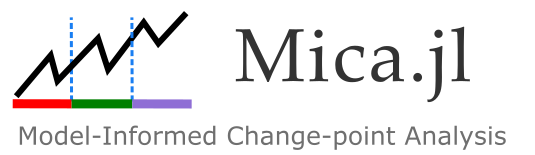

# Mica.jl – Model-Based Changepoint Analysis



Welcome to the documentation for **Mica.jl**.

Mica.jl provides a robust and model-driven approach to changepoint detection in time series data. 

---

## What is Mica.jl?

**Mica.jl** provides a model-driven alternative to conventional changepoint detection methods. While most existing tools rely on detecting shifts in statistical properties (like the mean or variance), Mica instead detects **changes in system dynamics** as reflected in model parameters.

This makes Mica well-suited for:
- Epidemiological modeling
- Engineering systems (e.g., thermal dynamics)
- Economic and ecological simulations
- Any domain where a **generative model** describes the system's behavior

---

## Key Features

- **Model-Aware Detection**: Integrates system models directly into the changepoint detection algorithm.
- **Supports Multiple Model Types**: (you can see more detaild explaination in [Supported Problem Types](@ref) page)
  - ODEs (Ordinary Differential Equations)
  - Difference equations
  - Regression-based models
  *(Support for additional model types coming in future releases)*
- **Evolutionary Optimization**: Uses genetic algorithms (via `Evolutionary.jl`) to estimate changepoints and parameters.
- **Customizable**: Supply your own model, loss function, or penalty criteria.
- **Interpretable Outputs**: Detects not just where change happens, but what **model parameters** change.

---

## Installation

To install Mica.jl, use the Julia package manager:

```julia-repl
julia> using Pkg
julia> Pkg.add("Mica")
```

## Citation

If you use **Mica.jl** in your research or applications, please cite the following paper:

> Mehdi Lotfi, *"Mica: Model-Informed Changepoint Analysis"*, [arXiv link or DOI].

---

## Presentations

- **TSCPDetector: A Comprehensive Approach to Change Point Detection in Time Series Models**  
  *Mehdi Lotfi, Lars Kaderali*  
  Presented at *Statistical Computing 2024, Günzburg, Germany*

- Upcoming: Presentation of **Mica.jl** at the *German Conference on Bioinformatics (GCB) 2025*


## Acknowledgments

**Mica.jl** is developed and maintained in the **Kaderali Lab**,  
Institute of Bioinformatics, University Medicine Greifswald.

**Address:**  
Institute of Bioinformatics  
University Medicine Greifswald  
Felix-Hausdorff-Str. 8  
17475 Greifswald, Germany