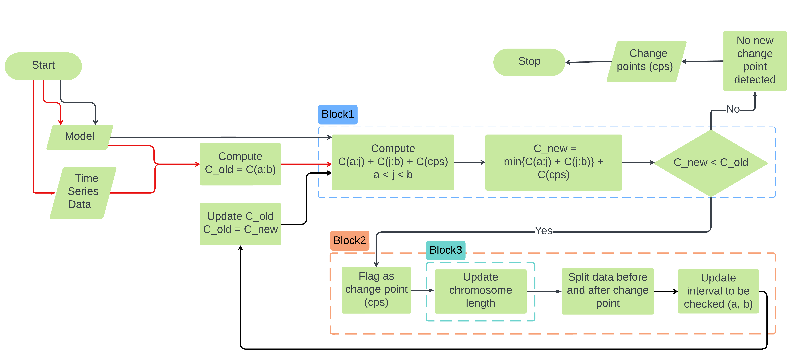

# Tutorial: Understanding Mocha's Changepoint Detection Algorithm

This tutorial provides a detailed, step-by-step walkthrough of Mocha's methodology for detecting changepoints in time series data. It is designed to help you understand not only how to use the package but also how the underlying algorithm works.

> 💡 **Note:** This tutorial is based on an ODE (Ordinary Differential Equation) model to illustrate the core concepts. However, the underlying methodology—segmentation, optimization, and changepoint detection—applies equally to all model types supported by Mocha.jl, including difference equations and regression models.

---

## Overview

Mocha detects changepoints in time-dependent systems by analyzing shifts in model parameters instead of raw statistical properties like mean or variance. The core idea is to fit a piecewise model where each segment has its own parameters, allowing detection of structural changes in the underlying system.

---

## Methodological Foundation

Mocha is designed around **Piecewise Switching ODEs (PSODEs)**, where a time series is assumed to be governed by different parameter regimes across segments. It generalizes a standard ODE:

```math
\frac{dy}{dt} = f(y,t,p)
```

into a segmented system:

```math
\frac{dy}{dt} = \sum_{i=1}^{k + 1} \mathbf{1}_{\{t_{i-1} \leq t < t_i\}} f_i(y,t, NSP, SP_i)
```

* **NSP**: Non-segment-specific parameters (global across all segments)
* **SP\_i**: Segment-specific parameters for segment `i`
* **t\_i**: Change points that separate the segments

The model guarantees **continuity** across segments by ensuring:

```math
y(t_i^-) = y(t_i^+)
```

This way, Mocha inherits the mathematical guarantees of traditional ODE theory within each segment.

---

## Problem Formulation

Formally, Mocha formulates changepoint detection as a model selection problem:

```math
V(CPs, y) = \sum_{i=1}^{k} c\left(x_{t_{i-1} \dots t_i}\right) + \text{penalty}
```

Where:

* `CPs`: Change points to detect
* `c(...)`: Cost function comparing model simulation vs. observed data in each segment
* `penalty`: Term to prevent overfitting (too many change points)

---

## Architecture


Algorithm Flowchart Summary: The algorithm follows a modular, iterative structure with three key blocks:

* Block 1 – Optimization Module: Solves the model over the full data and calculates baseline cost assuming no change points.

* Block 2 – Segmentation Module: Proposes potential change points using binary segmentation and evaluates candidate splits.

* Block 3 – Chromosome Updating: If a change point improves model fit, the chromosome is updated to include new segment-specific parameters. The process continues until no further improvement is observed.

The algorithm consists of three modules:

### 1. Segmentation Module (Propose Candidates)

* Uses a modified binary segmentation.
* Scans the data from start to end (forward pass) and end to start (backward pass).
* Ensures each proposed segment satisfies minimum length constraints.

### 2. Optimization Module (Validate Candidates)

* Uses a **genetic algorithm (GA)** to optimize model parameters.
* The GA evolves chromosomes representing the parameters.
* The structure is updated as new change points are added.

### 3. Interaction Layer

* Orchestrates the process:

  * Evaluates full model loss for proposed changepoints.
  * If a candidate improves fit (minus penalty), it is accepted.
  * Updates chromosome and restarts on new segments.

---

## Chromosome Structure in Optimization

The genetic algorithm uses a chromosome split into:

* Global parameters (NSP)
* Parameters for each segment (SP\_i)

As new change points are added, the chromosome dynamically expands:

```text
[NSP | SP_1 | SP_2 | ... | SP_k]
```

The GA minimizes the sum of squared errors + penalty:

```math
\sum_{k}\sum_{j}\sum_{i}(Data - Simulation)^2
```

Updating chromosome bound and length is done by [`Mocha.update_bounds!`](@ref) function.

---

## Iterative Process

1. **Initialization**:

   * Assume no change points.
   * Optimize global model using GA.

2. **Segmentation Proposals**:

   * Sweep the current segment with a window.
   * Try introducing a change point at each valid `j`.

3. **Evaluation**:

   * Run GA for each candidate segment split.
   * If adding a change point reduces loss significantly, accept it.

4. **Chromosome Update**:

   * Expand the chromosome.
   * Re-optimize.

5. **Repeat**:

   * Recurse into new segments using updated change points.
   * Stop when no more beneficial change points can be found.

---

## Penalty Functions

To avoid overfitting, Mocha uses customizable penalty functions. Some built-in examples:

* `default_penalty(p, n) = 2 * p * log(n)`
* `imbalance_penalty(p, n, CP)` penalizes unbalanced segment lengths.

Users can define their own functions and pass them into the API.

---

## Summary

Mocha is built to detect **true structural changes** in modeled time series systems. It:

* Supports custom models (ODEs, Difference, Regression)
* Detects changepoints via shifts in model parameters
* Uses evolutionary optimization for parameter fitting
* Can incorporate penalties and constraints for robust results

The modular design ensures you can plug in your own models, loss functions, and penalty strategies while taking advantage of Mocha's powerful changepoint detection engine.

